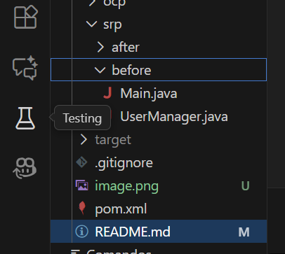
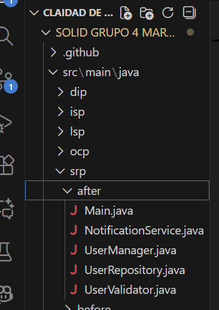
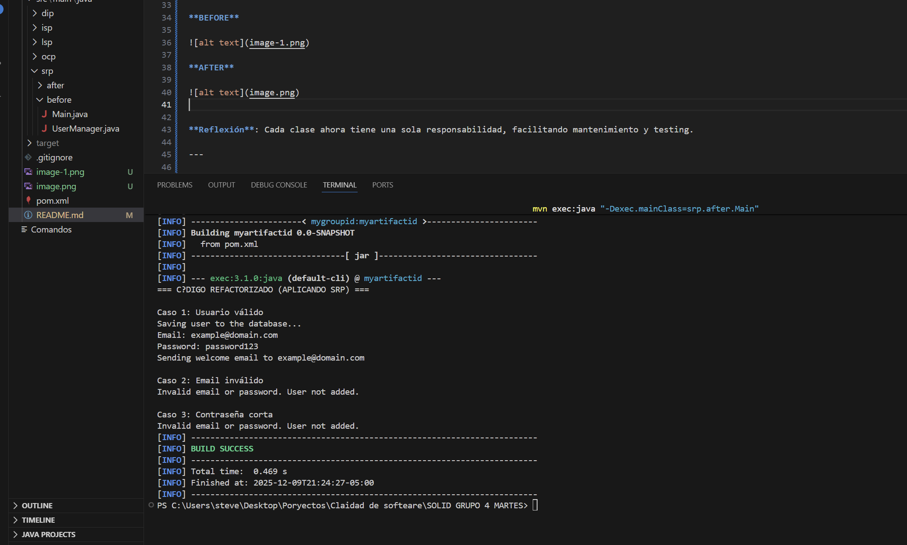

# Principios SOLID

## 👥 Grupo 4 - Martes

### Integrantes
- Steven Carrillo
- Amir Garcia
- Espin Humberto

---

## 📋 Descripción

Implementación de los 5 principios SOLID en Java mediante refactorización de código.

---

# 1️⃣ Single Responsibility Principle (SRP)

**Definición**: Una clase debe tener una única razón para cambiar.

**Problema**: `UserManager` manejaba validación, persistencia y notificaciones.

**Solución**: Se dividió en `UserValidator`, `UserRepository`, `NotificationService` y `UserManager`.

**Ejecución**:
```bash
mvn exec:java "-Dexec.mainClass=srp.before.Main"
mvn exec:java "-Dexec.mainClass=srp.after.Main"
```

### Capturas

**BEFORE**



**AFTER**




**Reflexión**: Cada clase ahora tiene una sola responsabilidad, facilitando mantenimiento y testing.

---

# 2️⃣ Open/Closed Principle (OCP)

**Definición**: Abierto para extensión, cerrado para modificación.

**Problema**: `NotificationService` usaba `if-else` para cada tipo de notificación.

**Solución**: Interfaz `Notification` con implementaciones: `EmailNotification`, `SMSNotification`, `PushNotification`.

**Ejecución**:
```bash
mvn exec:java "-Dexec.mainClass=ocp.before.Main"
mvn exec:java "-Dexec.mainClass=ocp.after.Main"
```

### Capturas

**BEFORE**


**AFTER**


**Reflexión**: Podemos agregar nuevos tipos sin modificar código existente.

---

# 3️⃣ Liskov Substitution Principle (LSP)

**Definición**: Las clases derivadas deben ser sustituibles por sus clases base.

**Problema**: `Fish` heredaba `walk()` de `Animal` pero lanzaba excepción.

**Solución**: `Animal` abstracta con `makeSound()`. Interfaz `Walkable` solo para animales que caminan.

**Ejecución**:
```bash
mvn exec:java "-Dexec.mainClass=lsp.before.Main"
mvn exec:java "-Dexec.mainClass=lsp.after.Main"
```

### Capturas

**BEFORE**


**AFTER**


**Reflexión**: Ninguna clase implementa métodos que no puede cumplir.

---

# 4️⃣ Interface Segregation Principle (ISP)

**Definición**: Una clase no debe implementar interfaces que no utiliza.

**Problema**: `DisposableCamera` forzada a implementar `charge()`.

**Solución**: Interfaces segregadas: `Powerable` (encender/apagar) y `Chargeable` (cargar).

**Ejecución**:
```bash
mvn exec:java "-Dexec.mainClass=isp.before.Main"
mvn exec:java "-Dexec.mainClass=isp.after.Main"
```

### Capturas

**BEFORE**


**AFTER**


**Reflexión**: Cada clase implementa solo los métodos que necesita.

---

# 5️⃣ Dependency Inversion Principle (DIP)

**Definición**: Depender de abstracciones, no de implementaciones concretas.

**Problema**: `PaymentProcessor` dependía directamente de `CreditCardPayment`.

**Solución**: Interfaz `PaymentMethod` con implementaciones: `CreditCardPayment`, `PayPalPayment`, `CryptoPayment`.

**Ejecución**:
```bash
mvn exec:java "-Dexec.mainClass=dip.before.Main"
mvn exec:java "-Dexec.mainClass=dip.after.Main"
```

### Capturas

**BEFORE**


**AFTER**


**Reflexión**: Usamos inyección de dependencias para mayor flexibilidad.

---

## 🚀 Compilar y Ejecutar
```bash
mvn clean compile
```

---

## 💡 Conclusión

Los principios SOLID mejoran la mantenibilidad, extensibilidad y testabilidad del código. Cada principio resuelve problemas específicos de diseño que hacen el software más robusto y profesional.

---

## 📅 Información

- **Curso**: ISWZ3208 - Mejores Prácticas en Desarrollo de Software
- **Grupo**: 4 - Martes
- **Fecha**: 16 de diciembre de 2025